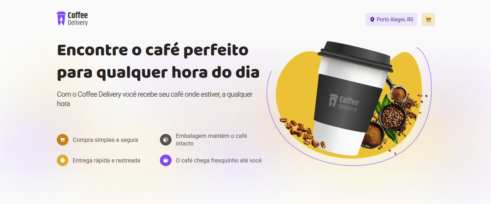

# Coffee Delivery

Esta aplicação foi desenvolvida a partir do desafio do treinamento de ReactJS da Rocketseat, o desafio proposto foi gerenciar o carrinho de compras de uma cafeteria. Para isso foi utilizado a ContextAPI e a dependência [IMMER](https://immerjs.github.io/immer/) que tem função de lidar de forma mais simples com a imutabilidade que é uma regra no React, React Router para criar rotas através de links e botões, styled-components foi utilizado para estilizar a aplicação, React Hook Form foi utilizado para gerenciar o formulário, foi utilizado também o [ZOD](https://zod.dev/) para realizar a validação do formulário em integração com o React Hook Form e esta funcionalidade não estava no escopo do desafio, por fim adicionei algumas features tais como, se o usuário clica no carrinho sem ter adicionado nenhum café ele é redirecionado para uma página explicando que o carrinho está vazio e um link para voltar para a página principal e desenvolvi também a versão mobile, ou seja a aplicação é responsiva e compatível com vários dispositivos móveis.

### Funcionalidades:

- Listagem de produtos (cafés) disponíveis para compra
- Adicionar uma quantidade específicas de itens no carrinho
- Aumentar ou remover a quantidade de itens no carrinho
- Formulário para o usuário preencher o seu endereço
- Exibir o total de itens no carrinho no Header
- Exibir o valor total da soma de itens no carrinho multiplicados pelo valor


### Foi praticado os conceitos como:

- Estados
- ContextAPI
- LocalStorage
- Imutabilidade do estado
- Listas e chaves no ReactJS
- Propriedades
- Componentização

## Tecnologias utilizadas


## Para Inicializar a aplicação utilize o seguinte comando:

```javascript
npm install
npm run dev

	or

yarn install
yarn dev
```

## A aplicação está hospedada na Vercel
[https://ignite-trilha2022-desafio02-coffee-delivery.vercel.app/](https://ignite-trilha2022-desafio02-coffee-delivery.vercel.app/)
